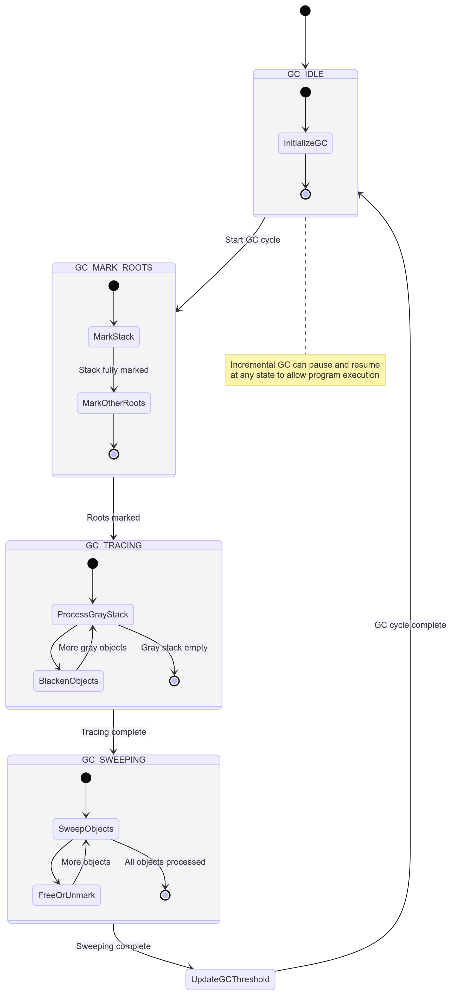

```txt
   +-------------------+
   |       START       |
   +-------------------+
            |
            v
   +-------------------+
   |      GC_IDLE      |<-----------------+
   +-------------------+                  |
            |                             |
            v                             |
   +-------------------+                  |
   |   GC_MARK_ROOTS   |                  |
   |                   |                  |
   | +---------------+ |                  |
   | |  Mark Stack   | |                  |
   | +---------------+ |                  |
   |         |         |                  |
   |         v         |                  |
   | +---------------+ |                  |
   | | Mark Frames   | |                  |
   | | Mark Globals  | |                  |
   | | Mark Strings  | |                  |
   | | Mark Upvalues | |                  |
   | +---------------+ |                  |
   +-------------------+                  |
            |                             |
            v                             |
   +-------------------+                  |
   |    GC_TRACING     |                  |
   |                   |                  |
   | +---------------+ |                  |
   | |  Gray Stack   | |                  |
   | |   +-+  +-+    | |                  |
   | |   |o|  |o|    | |                  |
   | |   +-+  +-+    | |                  |
   | +---------------+ |                  |
   |         |         |                  |
   |         v         |                  |
   | +---------------+ |                  |
   | | Blacken Objs  | |                  |
   | +---------------+ |                  |
   +-------------------+                  |
            |                             |
            v                             |
   +-------------------+                  |
   |    GC_SWEEPING    |                  |
   |                   |                  |
   | +---------------+ |                  |
   | | Object List   | |                  |
   | | [o]->[o]->[o] | |                  |
   | +---------------+ |                  |
   |         |         |                  |
   |         v         |                  |
   | +---------------+ |                  |
   | |  Free/Unmark  | |                  |
   | +---------------+ |                  |
   +-------------------+                  |
            |                             |
            v                             |
   +-------------------+                  |
   |    Update GC      |                  |
   |    Threshold      |------------------+
   +-------------------+
            |
            v
   +-------------------+
   |       END         |
   +-------------------+
```




# Steps
1. GC_IDLE: The starting point of each GC cycle.
2. GC_MARK_ROOTS:
  - Marks the stack
  - Marks other roots (frames, globals, strings, upvalues)
3. GC_TRACING:
  - Processes the gray stack
  - Blackens objects
4. GC_SWEEPING:
  - Goes through the object list
  - Frees unreachable objects
  - Unmarks reachable objects
5. Updates the GC threshold before returning to the IDLE state.
